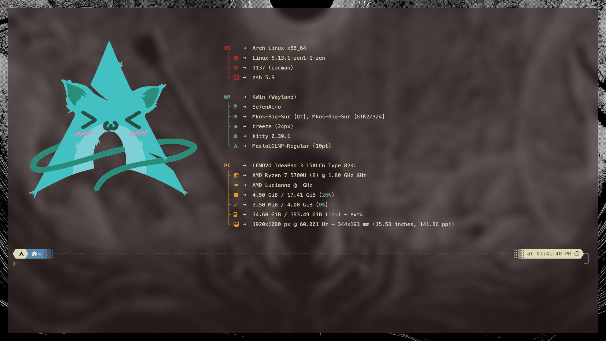
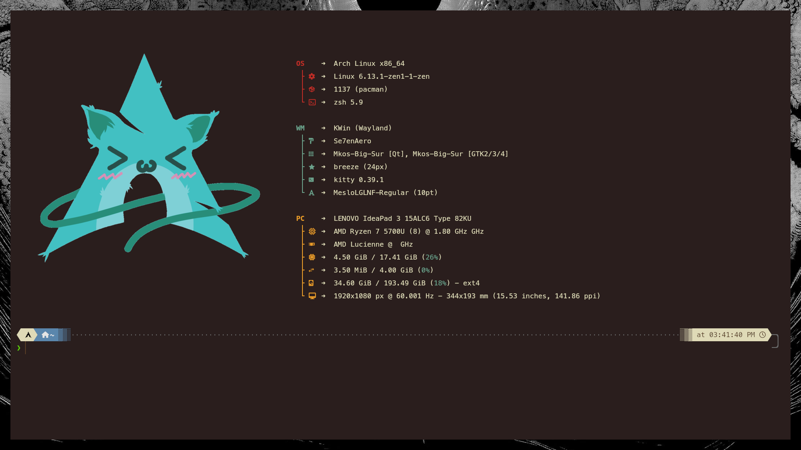

# My Kitty Terminal Configuration

A modern, aesthetic terminal configuration using the Bird of Paradise theme.


*Opacity down demonstration*


*Opacity up demonstration*

## Installation

1. Install Kitty terminal:

```bash
# On Ubuntu/Debian
sudo apt install kitty

# On Arch Linux
sudo pacman -S kitty
```

2. Clone this repository:

```bash
git clone https://github.com/yourusername/kitty-config.git ~/.config/kitty
```

